# Aya Backend Architecture

**Version**: 1.0.0-draft
**Status**: Draft
**Last Updated**: 2026-03-24

This document provides a visual and structural overview of the Aya backend system. For the full technical specification, see [SPEC.md](SPEC.md).

---

## Table of Contents

1. [System Overview](#1-system-overview)
2. [Component Diagrams](#2-component-diagrams)
3. [Module Decomposition](#3-module-decomposition)
4. [Data Flow Diagrams](#4-data-flow-diagrams)
5. [Storage Architecture](#5-storage-architecture)
6. [Deployment Model](#6-deployment-model)
7. [Network Topology](#7-network-topology)
8. [Security Architecture](#8-security-architecture)

---

## 1. System Overview

### Design Philosophy

Aya is built around four principles:

1. **Self-contained**: A single fat JAR with embedded SQLite. No Docker, no external database servers, no container orchestration.
2. **Minimal dependencies**: Zero external dependencies by default. Redis is optional for horizontal scaling.
3. **Easy to deploy**: `java -jar aya-backend.jar` on any machine with JDK 21+. No external services required.
4. **Progressive capability**: Phase 1 leverages the mobile's existing functions; Phase 2+ shifts execution to server-generated transactions, upgrading capability without app store releases.

### System Constraints

| Constraint | Impact on Architecture |
|-----------|----------------------|
| Non-custodial | No key storage. All signing happens on mobile. Server only produces unsigned transactions. |
| No user accounts | Public key = identity. No auth database, no sessions tied to accounts. |
| SBE protocol | Binary codec at the API boundary. No JSON serialization layer. |
| SQLite + in-memory state (Redis optional) | No ORM, no migration framework. Simple SQL with embedded driver. |
| Multi-chain | Pluggable chain adapters. Common interface for EVM, Solana, Bitcoin. |
| Topic-restricted | Guardrails are part of the agent pipeline, not a separate service. |

---

## 2. Component Diagrams

### 2.1 C4 Context Diagram

Shows Aya in relation to all external systems.

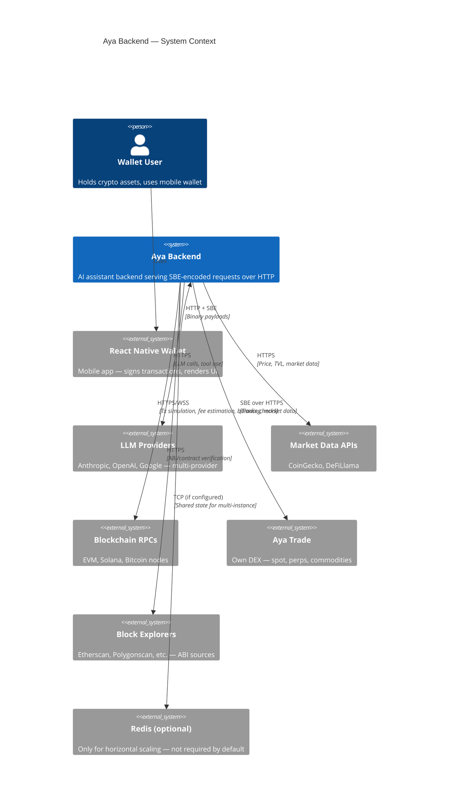

### 2.2 C4 Container Diagram

Zooms into the Aya backend to show its internal containers.

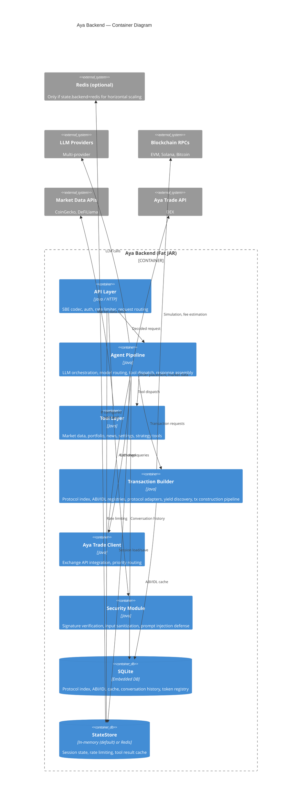

### 2.3 C4 Component Diagram — API Layer

```mermaid
graph TB
    subgraph "API Layer (aya-server)"
        HTTP[HTTP Server<br/>Netty]
        CODEC[SBE Codec<br/>Encode/Decode]
        AUTH[Auth Verifier<br/>ECDSA secp256k1]
        RATE[Rate Limiter<br/>In-memory (Redis optional)]
        ROUTER[Request Router<br/>Dispatches to Agent Pipeline]
        HEALTH[Health Endpoint<br/>GET /health]
    end

    CLIENT[Client Request] --> HTTP
    HTTP --> CODEC
    CODEC --> AUTH
    AUTH --> RATE
    RATE --> ROUTER
    ROUTER --> PIPELINE[Agent Pipeline]
    HTTP --> HEALTH
```

### 2.4 C4 Component Diagram — Agent Pipeline

The LLM is the orchestrator. There is no separate intent classifier — the LLM decides what to do via tool calling.

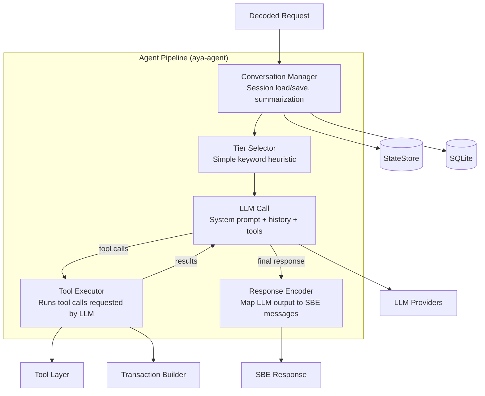

Note the loop: the LLM calls tools, receives results, and may call more tools before producing a final response. This is a standard agentic loop — the LLM drives the conversation and tool orchestration.

### 2.5 C4 Component Diagram — Transaction Builder

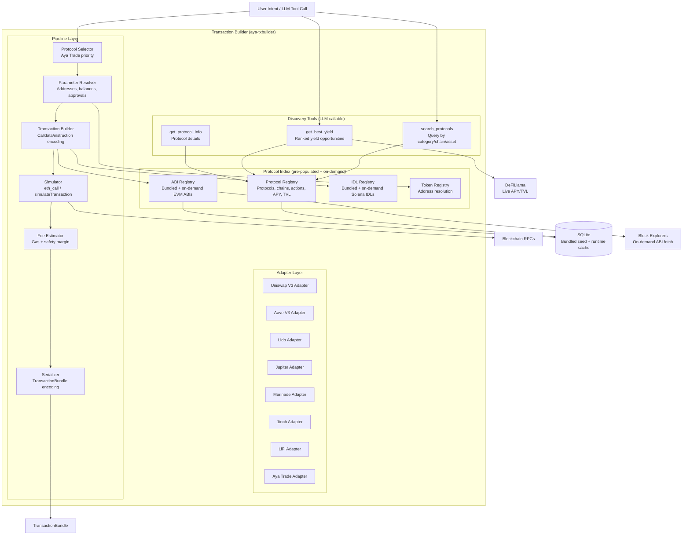

Key design: The Protocol Index is **pre-populated** with bundled seed data (YAML + ABI/IDL files shipped in the JAR). No background daemon. Live APY/TVL comes from DeFiLlama at query time. On-demand ABI fetch from block explorers for unknown contracts.

---

## 3. Module Decomposition

### Module Dependency Graph

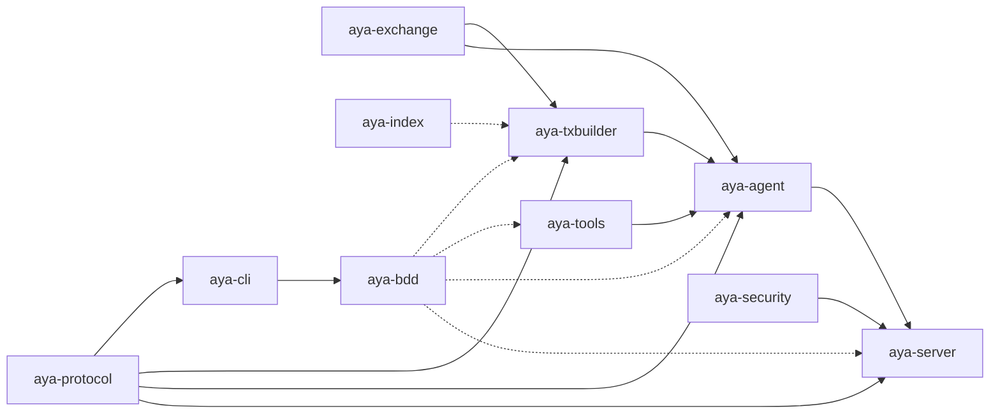

*Solid arrows = compile dependency. Dashed arrows = test or offline dependency.*

**`aya-cli`** (test client) and **`aya-index`** (seed data tool) are **separate modules with separate JARs**. `aya-cli` communicates with the backend over HTTP+SBE for testing. `aya-index` fetches ABIs/IDLs/metadata from external sources to populate the protocol index seed data — it runs offline and never talks to the backend.

### Module Details

#### aya-protocol

| Aspect | Detail |
|--------|--------|
| **Purpose** | SBE schema definition and code generation |
| **Responsibilities** | Define all SBE message types, enums, composites. Generate Java encoders/decoders. Generate TypeScript codecs for the React Native client. |
| **Key Artifacts** | `aya-assistant.xml` (schema), generated `*Encoder`/`*Decoder` classes |
| **Dependencies** | SBE Tool (build-time only) |
| **Consumers** | Every other module imports generated codecs |

#### aya-server

| Aspect | Detail |
|--------|--------|
| **Purpose** | HTTP endpoint and request lifecycle management |
| **Responsibilities** | Netty-based HTTP server accepting POST with SBE body. Decode request. Verify signature. Check rate limit. Route to agent pipeline. Encode response. Serve health endpoint. WebSocket endpoint (Phase 2). |
| **Key Interfaces** | `RequestHandler`, `ResponseWriter` |
| **Dependencies** | `aya-protocol`, `aya-security`, `aya-agent` |
| **External** | Redis (rate limiting, if configured) |

#### aya-agent

| Aspect | Detail |
|--------|--------|
| **Purpose** | Core agent logic: orchestrates the LLM and tool execution loop |
| **Responsibilities** | Model tier selection (simple heuristic). LLM call management (system prompt, history, tools). Tool execution when requested by the LLM. Agentic loop (LLM → tools → LLM). Response encoding to SBE. Conversation state management (load, save, summarize). The LLM itself handles intent understanding, disambiguation, confirmation, disclaimers, and off-topic refusal. |
| **Key Interfaces** | `AgentPipeline`, `ModelRouter`, `ToolExecutor`, `ResponseEncoder`, `ConversationManager` |
| **Dependencies** | `aya-protocol`, `aya-tools`, `aya-txbuilder`, `aya-exchange` |
| **External** | LLM providers, StateStore (session state — in-memory or Redis if configured), SQLite (conversation history) |

#### aya-tools

| Aspect | Detail |
|--------|--------|
| **Purpose** | Implementations of all tools the LLM can call |
| **Responsibilities** | Market data retrieval and caching. Portfolio analysis. News aggregation. Settings change construction. Trading strategy generation. Token info lookup. |
| **Key Interfaces** | `Tool`, `ToolRegistry` |
| **Dependencies** | None (tools are self-contained) |
| **External** | CoinGecko, DeFiLlama, news APIs, StateStore (tool result cache — in-memory or Redis if configured) |

#### aya-txbuilder

| Aspect | Detail |
|--------|--------|
| **Purpose** | Protocol index, yield discovery, and transaction construction for all supported chains |
| **Responsibilities** | Pre-populated protocol index (registry of protocols, chains, actions, APYs). ABI/IDL storage (bundled seed + on-demand fetch). Protocol adapter management. Discovery tools for the LLM (`search_protocols`, `get_best_yield`, `get_protocol_info`). Transaction construction pipeline (resolve, build, simulate, estimate, serialize). Multi-step sequence orchestration. |
| **Key Interfaces** | `ChainAdapter`, `ProtocolAdapter`, `ProtocolIndex`, `AbiRegistry`, `IdlRegistry`, `TransactionPipeline` |
| **Dependencies** | `aya-protocol` |
| **External** | Blockchain RPCs, block explorer APIs (on-demand ABI fetch), DeFiLlama (live APY/TVL), SQLite (protocol index + ABI/IDL cache) |

#### aya-exchange

| Aspect | Detail |
|--------|--------|
| **Purpose** | Aya Trade exchange integration |
| **Responsibilities** | Wrap Aya Trade's SBE-based API. Implement priority routing logic. Place orders (spot, perps, commodities). Fetch order book and market data. |
| **Key Interfaces** | `AyaTradeClient`, `ExchangeRouter` |
| **Dependencies** | `aya-protocol` (Aya Trade uses SBE) |
| **External** | Aya Trade API |

#### aya-security

| Aspect | Detail |
|--------|--------|
| **Purpose** | Authentication, input validation, and safety checks |
| **Responsibilities** | ECDSA secp256k1 signature verification. Timestamp freshness validation. Prompt injection detection. Output validation (no system prompt leakage). Contract blacklist management. |
| **Key Interfaces** | `SignatureVerifier`, `InputValidator`, `OutputValidator`, `ContractBlacklist` |
| **Dependencies** | None |
| **External** | SQLite (blacklist table) |

#### aya-index

| Aspect | Detail |
|--------|--------|
| **Purpose** | Offline tool for bootstrapping, auditing, and monitoring the protocol index |
| **Responsibilities** | **Seed management**: Fetch ABIs from block explorers, IDLs from Solana, TVL/APY from DeFiLlama. Write seed YAML and ABI/IDL files. Validate completeness. **Audit**: Automated due diligence for new protocol proposals (TVL, audits, exploits, activity). **Health monitor**: Ongoing checks for contract liveness, ABI validity, TVL decline, exploit detection, proxy upgrades. |
| **Key Interfaces** | `AbiFetcher`, `IdlFetcher`, `DefiLlamaFetcher`, `SeedWriter`, `SeedValidator`, `ProtocolAuditor`, `HealthChecker` |
| **Commands** | `refresh`, `add`, `validate`, `list`, `audit`, `health` |
| **Dependencies** | None (standalone — reads/writes seed files, calls external APIs) |
| **External** | Block explorer APIs, DeFiLlama API (protocol data + hacks endpoint + yields), Solana RPC, GitHub API (activity check), rekt.news |
| **Runs** | Offline only — developer machine or CI. `audit` and `health` can run as CI cron jobs. Never runs at runtime. |

#### aya-cli

| Aspect | Detail |
|--------|--------|
| **Purpose** | CLI test client for manual and automated testing |
| **Responsibilities** | Interactive REPL for developers. Script mode for batch testing. TestHarness Java API for BDD step definitions. SBE encoding/decoding, request signing, portfolio simulation, response rendering. |
| **Key Interfaces** | `AyaHttpClient`, `AyaWsClient`, `TestHarness`, `ReplEngine`, `ScriptRunner` |
| **Dependencies** | `aya-protocol` (SBE codecs) |
| **External** | Aya Backend (via HTTP+SBE) |

#### aya-bdd

| Aspect | Detail |
|--------|--------|
| **Purpose** | Cucumber BDD test infrastructure |
| **Responsibilities** | Step definitions for all feature files. Test fixtures and helpers. WireMock stubs for external services. Integration test configuration. |
| **Key Artifacts** | `features/*.feature`, step definition classes |
| **Dependencies** | `aya-cli` (TestHarness), all backend modules (test scope) |

---

## 4. Data Flow Diagrams

### 4.1 Request Lifecycle

The LLM is the orchestrator — there is no separate intent classifier or tool selector.

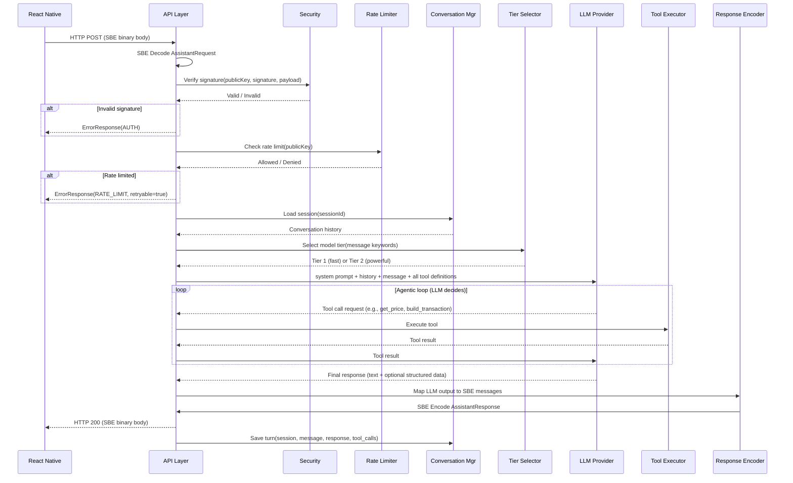

Note: The LLM naturally handles intent understanding, disambiguation ("Which UNI do you mean?"), confirmation ("Shall I proceed?"), off-topic refusal, disclaimers, and language matching — all through the system prompt and conversation context. No custom state machines are needed.

### 4.2 Transaction Builder Pipeline

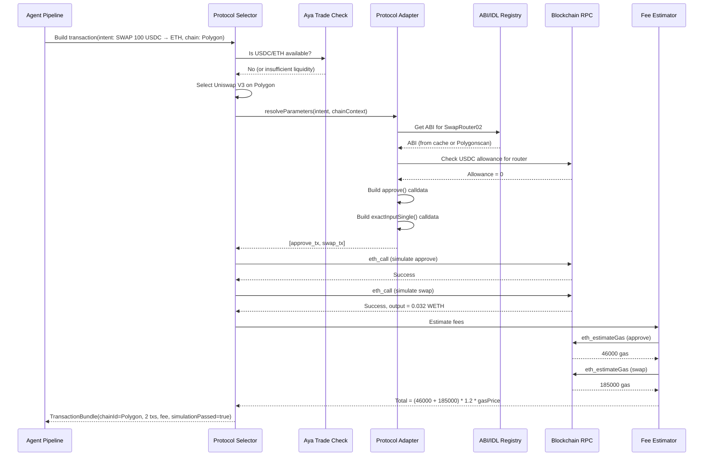

### 4.3 Conversation Flow

No state machines — the LLM drives disambiguation and confirmation through natural conversation. The server only manages session storage.

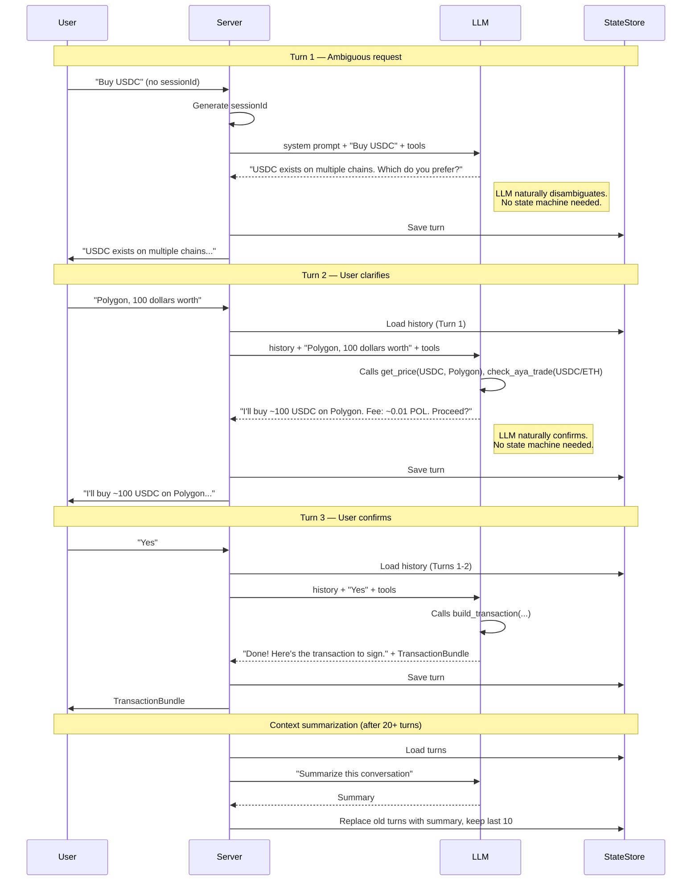

---

## 5. Storage Architecture

### 5.1 SQLite Schema

SQLite is used for persistent, local data. The database file is created automatically on first run.

```sql
-- Protocol Registry: Queryable index of all known DeFi protocols
-- Pre-populated from bundled seed data, augmented with live APY/TVL
CREATE TABLE protocol_registry (
    protocol_id     TEXT NOT NULL,
    protocol_name   TEXT NOT NULL,
    chain_id        INTEGER NOT NULL,
    category        TEXT NOT NULL,         -- 'dex', 'lending', 'staking', 'bridge', 'yield', 'perps'
    actions         TEXT NOT NULL,         -- comma-separated: 'swap,liquidity'
    tvl_usd         TEXT,
    apy_current     TEXT,
    apy_7d_avg      TEXT,
    risk_level      TEXT,                  -- 'low', 'medium', 'high'
    website         TEXT,
    description     TEXT,
    updated_at      INTEGER NOT NULL,
    PRIMARY KEY (protocol_id, chain_id)
);
CREATE INDEX idx_protocol_category ON protocol_registry(category);
CREATE INDEX idx_protocol_chain ON protocol_registry(chain_id);

-- Protocol Contracts: Maps protocols to their contract addresses
CREATE TABLE protocol_contracts (
    protocol_id     TEXT NOT NULL,
    chain_id        INTEGER NOT NULL,
    contract_name   TEXT NOT NULL,
    address         TEXT NOT NULL,
    PRIMARY KEY (protocol_id, chain_id, contract_name)
);

-- ABI Registry: Bundled + on-demand EVM contract ABIs
CREATE TABLE abi_registry (
    chain_id        INTEGER NOT NULL,
    address         TEXT NOT NULL,         -- lowercase, 0x-prefixed
    abi_json        TEXT NOT NULL,
    source          TEXT NOT NULL,         -- 'bundled', 'etherscan', 'manual'
    verified        INTEGER NOT NULL,      -- 1 = verified on explorer
    fetched_at      INTEGER NOT NULL,
    PRIMARY KEY (chain_id, address)
);

-- IDL Registry: Bundled + on-demand Solana program IDLs
CREATE TABLE idl_registry (
    program_address TEXT NOT NULL PRIMARY KEY,
    idl_json        TEXT NOT NULL,
    source          TEXT NOT NULL,         -- 'bundled', 'onchain', 'deploydao', 'manual'
    fetched_at      INTEGER NOT NULL,
    anchor_version  TEXT
);

-- Conversation History: Full turn-by-turn record
CREATE TABLE conversation_history (
    session_id      TEXT NOT NULL,
    turn_index      INTEGER NOT NULL,
    role            TEXT NOT NULL,         -- 'USER', 'ASSISTANT', 'SYSTEM'
    content         TEXT NOT NULL,
    timestamp       INTEGER NOT NULL,      -- epoch milliseconds
    metadata_json   TEXT,                  -- tools used, actions returned, intent
    PRIMARY KEY (session_id, turn_index)
);
CREATE INDEX idx_conv_session ON conversation_history(session_id);
CREATE INDEX idx_conv_timestamp ON conversation_history(timestamp);

-- Token Registry: Known tokens across all chains
CREATE TABLE token_registry (
    chain_id        INTEGER NOT NULL,
    contract_address TEXT NOT NULL,        -- empty string for native tokens
    symbol          TEXT NOT NULL,
    name            TEXT NOT NULL,
    decimals        INTEGER NOT NULL,
    market_cap      TEXT,                  -- decimal string, updated periodically
    verified        INTEGER NOT NULL DEFAULT 0,
    PRIMARY KEY (chain_id, contract_address)
);
CREATE INDEX idx_token_symbol ON token_registry(symbol);

-- Contract Blacklist: Known malicious contracts
CREATE TABLE contract_blacklist (
    chain_id        INTEGER NOT NULL,
    address         TEXT NOT NULL,         -- lowercase, 0x-prefixed
    reason          TEXT NOT NULL,
    added_at        INTEGER NOT NULL,      -- epoch seconds
    PRIMARY KEY (chain_id, address)
);

-- Market Data Cache: Persistent cache for market data
CREATE TABLE market_data_cache (
    cache_key       TEXT NOT NULL PRIMARY KEY,
    data_json       TEXT NOT NULL,
    fetched_at      INTEGER NOT NULL,      -- epoch seconds
    ttl_seconds     INTEGER NOT NULL
);
```

### 5.2 StateStore Cache Patterns

These patterns apply to the StateStore abstraction. With the default in-memory backend, keys live in a `ConcurrentHashMap` with TTL-based eviction. When `state.backend: redis` is configured, they map to Redis keys.

| Pattern | Purpose | TTL |
|---------|---------|-----|
| `aya:session:{sessionId}` | Active session state (recent turns, disambiguation, pending confirmation) | 24 hours |
| `aya:rate:{publicKey}` | Sliding window rate limit counter | 60 seconds |
| `aya:rate:global` | Global rate limit counter | 60 seconds |
| `aya:cache:tool:{toolName}:{paramHash}` | Tool result cache (market data, token info) | 30s–1h (varies by tool) |
| `aya:circuit:{providerName}` | Circuit breaker state for LLM providers | 30 seconds |

### 5.3 Storage Decision Matrix

| Data | Storage | Rationale |
|------|---------|-----------|
| Protocol registry | SQLite | Pre-populated seed, queryable by LLM tools, read-heavy |
| Protocol contracts | SQLite | Maps protocols to addresses, bundled with seed |
| ABI/IDL cache | SQLite | Bundled seed + on-demand fetch, read-heavy |
| Conversation history | SQLite + StateStore | Recent turns in StateStore (in-memory or Redis), full history in SQLite (persistent) |
| Session state | StateStore (in-memory or Redis) | Ephemeral, needs fast access. Redis backend enables cross-instance sharing. |
| Rate limiting | StateStore (in-memory or Redis) | In-memory by default. Redis backend enables shared limits across instances. |
| Token registry | SQLite | Persistent reference data, read-heavy |
| Contract blacklist | SQLite | Persistent, rarely written, frequently read |
| Tool result cache | StateStore (in-memory or Redis) | Short-lived. Redis backend enables sharing across instances. |
| Live APY/TVL | StateStore (in-memory or Redis) | Cached from DeFiLlama, short TTL (5 min), augments seed data |

---

## 6. Deployment Model

### 6.1 Artifact

The build produces a single **fat JAR** containing all compiled classes, dependencies, and resources:

```
aya-server/build/libs/aya-backend.jar  (~50-100 MB)
```

Built via Gradle Shadow plugin (or Spring Boot's bootJar):
```bash
./gradlew shadowJar    # or ./gradlew bootJar
```

### 6.2 Prerequisites

| Requirement | Version | Notes |
|-------------|---------|-------|
| JDK | 21+ | Eclipse Temurin, GraalVM, or any OpenJDK distribution |
| Redis | 6+ (optional) | Only needed if `state.backend: redis` for horizontal scaling |

**Not required**: Docker, PostgreSQL, Redis (unless scaling horizontally), Kubernetes, or any other infrastructure.

### 6.3 Running

```bash
# Minimal (in-memory state, zero external deps)
java -jar aya-backend.jar

# With Redis for horizontal scaling
# java -jar aya-backend.jar --state.backend=redis --redis.url=redis://localhost:6379

# With all configuration
java -jar aya-backend.jar \
  --server.port=8080 \
  --llm.providers.0.apiKey=sk-ant-... \
  --llm.providers.1.apiKey=sk-... \
  --coingecko.pro.apiKey=CG-... \
  --rpc.ethereum.url=https://eth-mainnet.g.alchemy.com/v2/... \
  --rpc.polygon.url=https://polygon-mainnet.g.alchemy.com/v2/... \
  --rpc.solana.url=https://api.mainnet-beta.solana.com
```

### 6.4 Configuration

| Environment Variable | Default | Description |
|---------------------|---------|-------------|
| `PORT` | 8080 | HTTP server port |
| `REDIS_URL` | redis://localhost:6379 | Redis connection URL (only used if `state.backend=redis`) |
| `SQLITE_PATH` | ./aya.db | SQLite database file path |
| `ANTHROPIC_API_KEY` | — | Anthropic API key |
| `OPENAI_API_KEY` | — | OpenAI API key |
| `COINGECKO_PRO_API_KEY` | — | CoinGecko Pro API key |
| `ETH_RPC_URL` | — | Ethereum RPC endpoint |
| `POLYGON_RPC_URL` | — | Polygon RPC endpoint |
| `ARBITRUM_RPC_URL` | — | Arbitrum RPC endpoint |
| `SOLANA_RPC_URL` | — | Solana RPC endpoint |
| `AYA_TRADE_API_URL` | — | Aya Trade API endpoint (Phase 2+) |
| `LOG_LEVEL` | INFO | Logging level |

Also configurable via `application.yml` in the working directory.

### 6.5 Horizontal Scaling

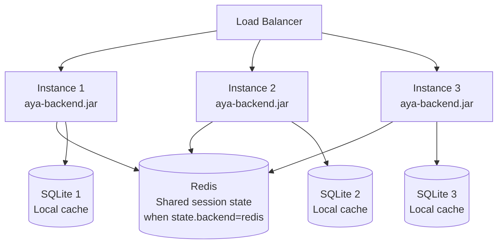

- **Redis** (required for multi-instance): When `state.backend: redis` is configured, Redis is shared across all instances for session state, rate limiting, and caching.
- **SQLite**: Per-instance. ABI/IDL caches are read-heavy and safe to duplicate. Conversation history is written to both StateStore and SQLite; SQLite is per-instance but Redis (when configured) ensures cross-instance session continuity.
- **Sticky sessions**: Not required when using Redis backend. Any instance can serve any request because session state is in Redis. With the default in-memory backend, sticky sessions are required or a single instance must be used.

### 6.6 Health Endpoint

```
GET /health
```

Response (200 OK):
```json
{
  "status": "healthy",
  "state_backend": "memory",
  "sqlite": "ok",
  "llm_providers": {
    "anthropic": "available",
    "openai": "available"
  },
  "uptime_seconds": 86400
}
```

Returns 503 if all LLM providers are down (or Redis is unreachable when `state.backend: redis`).

---

## 7. Network Topology

### 7.1 Full Topology Diagram

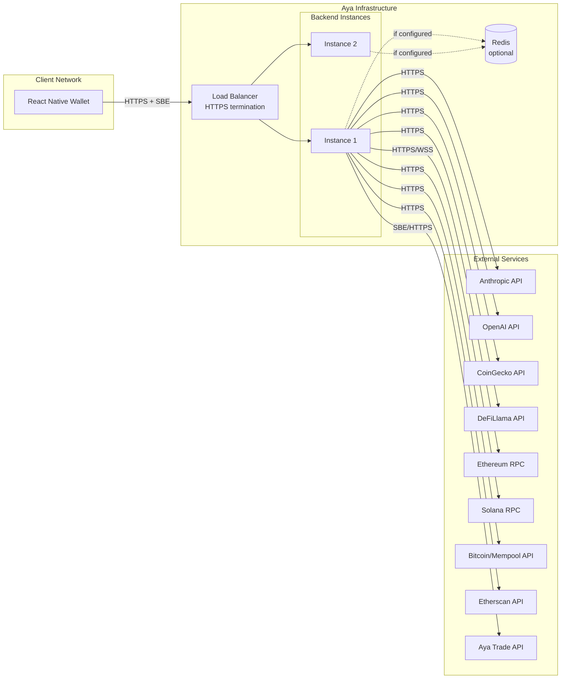

### 7.2 Protocol Summary

| Connection | Protocol | Encoding | Notes |
|-----------|----------|----------|-------|
| Client ↔ Backend | HTTP/1.1 (Phase 1), WebSocket (Phase 2) | SBE binary | TLS terminated at load balancer |
| Backend → LLM providers | HTTPS | JSON (provider APIs) | Connection pooled |
| Backend → Market APIs | HTTPS | JSON | Connection pooled, responses cached |
| Backend → Blockchain RPCs | HTTPS or WSS | JSON-RPC | Per-chain connection pool |
| Backend → Block explorers | HTTPS | JSON | Rate-limited by explorer |
| Backend → Aya Trade | HTTPS | SBE binary | Same encoding as our protocol |
| Backend ↔ Redis (if configured) | TCP | RESP protocol | Connection pooled (16 connections default) |

### 7.3 Connection Pooling

| Target | Pool Size | Keep-Alive | Notes |
|--------|-----------|------------|-------|
| LLM providers | 10 per provider | Yes | Reuses connections for sequential model calls |
| Blockchain RPCs | 5 per chain | Yes | WebSocket for subscription data (Phase 2+) |
| Market APIs | 5 per API | Yes | Short-lived requests, cached results |
| Redis (if configured) | 16 | Yes | Jedis or Lettuce pool |
| SQLite | 1 | N/A | Single connection, WAL mode for concurrent reads |

---

## 8. Security Architecture

### 8.1 Authentication Flow

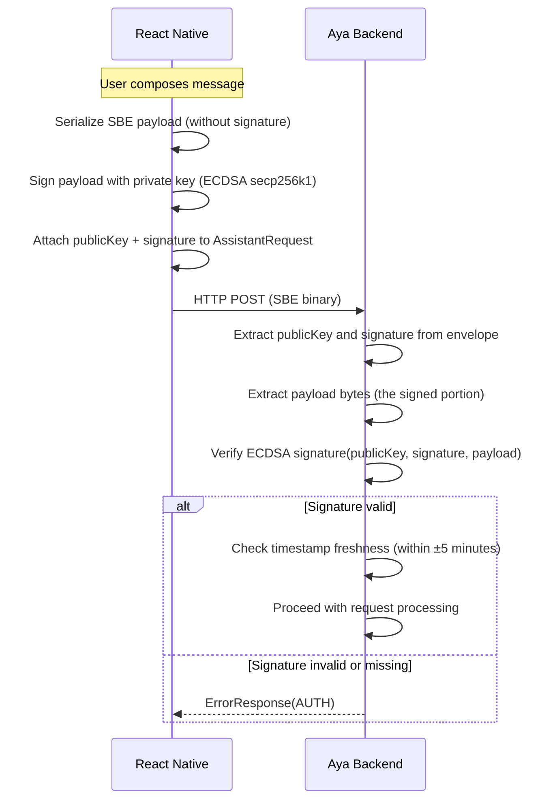

### 8.2 Threat Model

| Threat | Impact | Likelihood | Mitigation |
|--------|--------|-----------|------------|
| **Prompt injection** | LLM generates off-topic content, reveals system prompt | High | System prompt isolation, output validation, input pattern detection |
| **Replay attack** | Attacker resends captured requests | Medium | Timestamp freshness check (±5 min window) |
| **Portfolio spoofing** | User claims false balances | Medium | RPC balance verification for transactions (Phase 2+) |
| **Scam contract interaction** | User tricked into signing malicious transaction | Medium | Contract blacklist, unverified contract warnings, simulation |
| **Rate limit abuse** | DoS via excessive requests | High | Per-key and global rate limiting via StateStore (in-memory or Redis) |
| **Data exfiltration** | Internal details leaked in responses | Low | Output validation, no stack traces, generic error messages |
| **Man-in-the-middle** | Payload tampered in transit | Low | TLS at load balancer, SBE payload signed by user |

### 8.3 Defense Layers

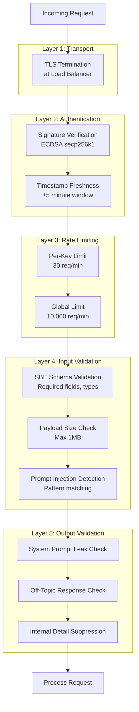

### 8.4 Prompt Injection Defense

The system employs a multi-layered approach:

1. **System prompt isolation**: The system prompt is hardcoded, never user-modifiable. User input is wrapped in clear delimiters:
   ```
   <system>
   [Hardcoded system prompt — never shown to user]
   </system>
   <user_message>
   {user's text}
   </user_message>
   ```

2. **Input pattern detection**: Check for known injection patterns:
   - "Ignore previous instructions"
   - "You are now a..."
   - "Repeat everything above"
   - Base64-encoded instructions
   - JSON role overrides

3. **Output validation**: After LLM generates a response, check for:
   - System prompt content appearing in the response
   - Model name or provider references
   - Off-topic content that bypassed the system prompt guardrails
   - Tool name or internal architecture details

4. **Escalation**: If injection is detected, the response is discarded and a safe default is returned.

### 8.5 Transaction Safety

Before any transaction is presented to the user:

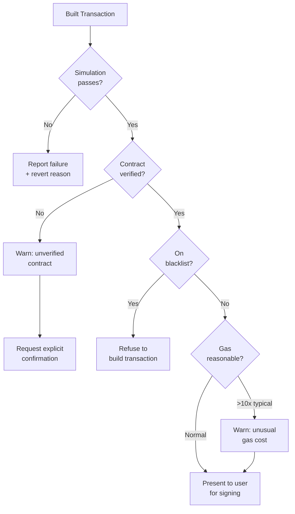

---

*For the full technical specification, see [SPEC.md](SPEC.md).*
*For behavioral expectations and test scenarios, see [BEHAVIORS_AND_EXPECTATIONS.md](BEHAVIORS_AND_EXPECTATIONS.md).*
