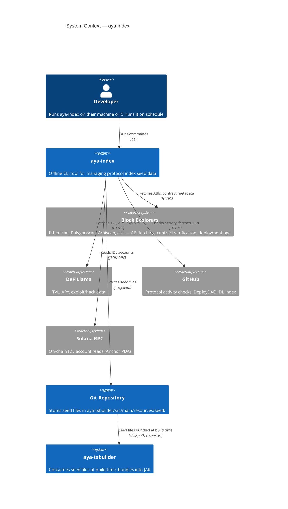
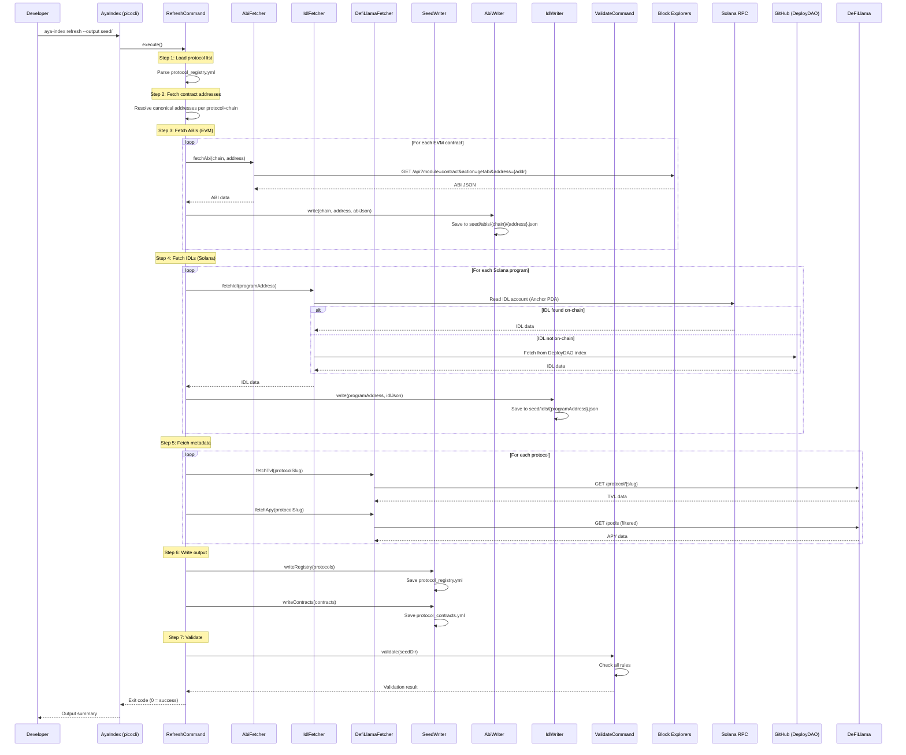
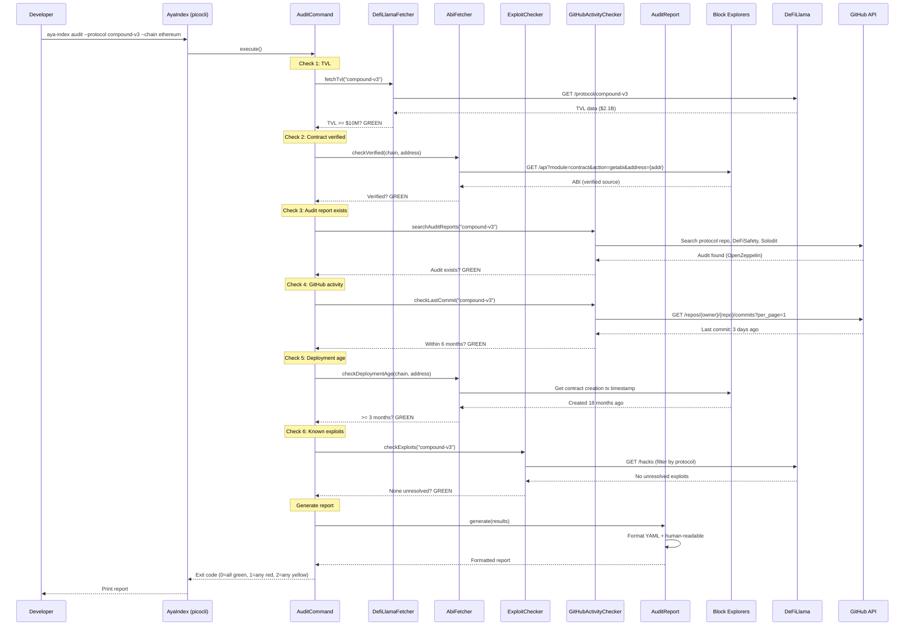
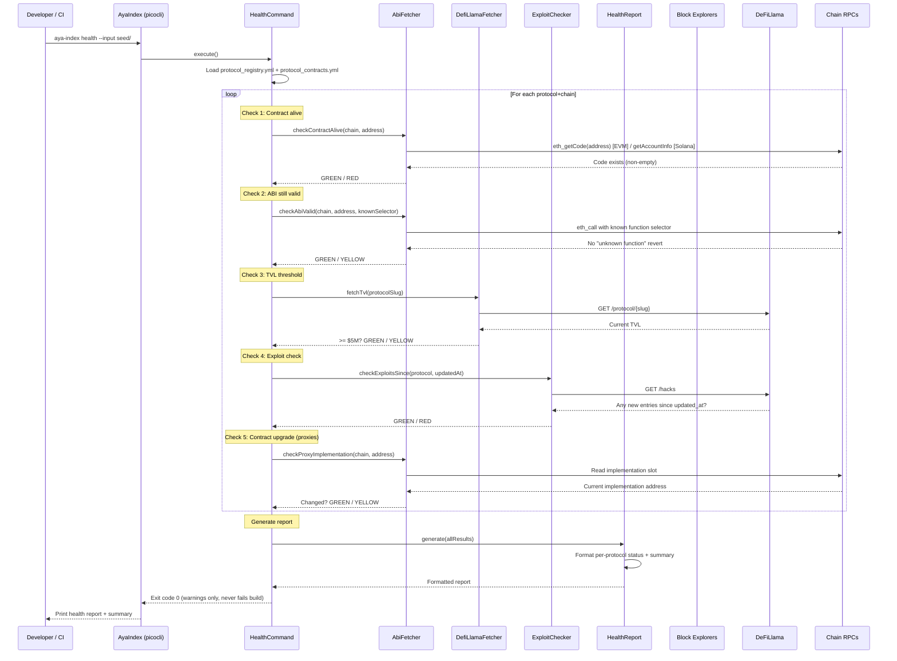

# Aya Index — Architecture Document

**Version**: 1.0.0-draft
**Status**: Draft
**Last Updated**: 2026-03-26
**Parent**: AYA_INDEX_SPEC.md

---

## Table of Contents

1. [System Context](#1-system-context)
2. [Component Diagram](#2-component-diagram)
3. [Data Flow — Refresh](#3-data-flow--refresh)
4. [Data Flow — Audit](#4-data-flow--audit)
5. [Data Flow — Health Check](#5-data-flow--health-check)
6. [Deployment](#6-deployment)

---

## 1. System Context

`aya-index` is an offline CLI tool that interacts with external data sources to produce seed files. Those seed files are committed to the repository and consumed by `aya-txbuilder` at build time.



**Key boundaries:**

- `aya-index` never communicates with `aya-backend` or `aya-txbuilder` at runtime.
- The only output of `aya-index` is files written to the filesystem.
- The only inputs are the existing seed directory (for validate/health) and external APIs (for refresh/add/audit).

---

## 2. Component Diagram

```mermaid
graph TB
    subgraph "aya-index"
        EP[AyaIndex.java<br/>Entry Point + picocli]

        EP --> RC[RefreshCommand]
        EP --> AC[AddCommand]
        EP --> VC[ValidateCommand]
        EP --> LC[ListCommand]
        EP --> AUC[AuditCommand]
        EP --> HC[HealthCommand]

        subgraph "fetcher/"
            AF[AbiFetcher<br/>Block explorer APIs]
            IF[IdlFetcher<br/>Solana RPC + DeployDAO]
            DLF[DefiLlamaFetcher<br/>TVL, APY, pools]
            EC[ExploitChecker<br/>DeFiLlama /hacks]
            GAC[GitHubActivityChecker<br/>GitHub API]
        end

        subgraph "writer/"
            SW[SeedWriter<br/>protocol_registry.yml<br/>protocol_contracts.yml]
            AW[AbiWriter<br/>abis/{chain}/{address}.json]
            IW[IdlWriter<br/>idls/{programAddress}.json]
        end

        subgraph "report/"
            AR[AuditReport<br/>YAML + human-readable]
            HR[HealthReport<br/>YAML + human-readable]
        end

        RC --> AF
        RC --> IF
        RC --> DLF
        RC --> SW
        RC --> AW
        RC --> IW
        RC --> VC

        AC --> AF
        AC --> IF
        AC --> DLF
        AC --> SW
        AC --> AW
        AC --> IW
        AC --> VC

        AUC --> DLF
        AUC --> AF
        AUC --> GAC
        AUC --> EC
        AUC --> AR

        HC --> AF
        HC --> DLF
        HC --> EC
        HC --> HR
    end

    subgraph "External APIs"
        BE[Block Explorers<br/>Etherscan, Polygonscan, etc.]
        DL[DeFiLlama<br/>api.llama.fi / yields.llama.fi]
        GH[GitHub API<br/>api.github.com]
        SR[Solana RPC<br/>api.mainnet-beta.solana.com]
    end

    subgraph "Output"
        SEED[seed/<br/>YAML + JSON files]
    end

    AF --> BE
    IF --> SR
    IF --> GH
    DLF --> DL
    EC --> DL
    GAC --> GH

    SW --> SEED
    AW --> SEED
    IW --> SEED
```

**Component responsibilities:**

| Component | Responsibility |
|-----------|---------------|
| `AyaIndex` | Entry point. Parses CLI arguments via picocli, routes to the correct command. |
| `RefreshCommand` | Orchestrates a full refresh: load protocol list, invoke fetchers, invoke writers, run validate. |
| `AddCommand` | Adds a single protocol: update registry, invoke fetchers for that protocol, run validate. |
| `ValidateCommand` | Reads the seed directory and checks all completeness rules. |
| `ListCommand` | Reads `protocol_registry.yml` and prints a formatted table. |
| `AuditCommand` | Runs due diligence checks against external APIs and produces an audit report. |
| `HealthCommand` | Runs health checks for all indexed protocols and produces a health report. |
| `AbiFetcher` | Calls block explorer APIs to fetch EVM contract ABIs. |
| `IdlFetcher` | Reads Solana on-chain IDL accounts (Anchor PDA) with fallback to DeployDAO GitHub. |
| `DefiLlamaFetcher` | Calls DeFiLlama for TVL, APY, and pool data. |
| `ExploitChecker` | Calls DeFiLlama `/hacks` endpoint to check for known exploits. |
| `GitHubActivityChecker` | Calls GitHub API to check last commit date for protocol repositories. |
| `SeedWriter` | Writes `protocol_registry.yml` and `protocol_contracts.yml`. |
| `AbiWriter` | Writes ABI JSON files to `seed/abis/{chain}/{address}.json`. |
| `IdlWriter` | Writes IDL JSON files to `seed/idls/{programAddress}.json`. |
| `AuditReport` | Generates structured audit output (YAML + human-readable text). |
| `HealthReport` | Generates structured health output (YAML + human-readable text). |

---

## 3. Data Flow — Refresh



---

## 4. Data Flow — Audit



---

## 5. Data Flow — Health Check



---

## 6. Deployment

### 6.1 Packaging

`aya-index` is packaged as a single fat JAR containing all dependencies. It is built with Gradle's `shadowJar` plugin (or equivalent).

```bash
# Build
./gradlew :aya-index:shadowJar

# Run
java -jar aya-index/build/libs/aya-index.jar <command> [options]
```

### 6.2 No Docker

`aya-index` does not require Docker. It is a simple CLI tool that runs on any machine with Java 21+.

### 6.3 CI Integration

| Use Case | Trigger | Command |
|----------|---------|---------|
| Weekly health check | Cron schedule (e.g., every Monday) | `java -jar aya-index.jar health --input aya-txbuilder/src/main/resources/seed/` |
| Pre-release refresh | Manual or release pipeline | `java -jar aya-index.jar refresh --output aya-txbuilder/src/main/resources/seed/` |
| PR validation | On PR that modifies `seed/` | `java -jar aya-index.jar validate --input aya-txbuilder/src/main/resources/seed/` |

### 6.4 Gradle Task Wrappers

```groovy
// In aya-index/build.gradle
task protocolHealth(type: JavaExec) {
    classpath = sourceSets.main.runtimeClasspath
    mainClass = 'aya.index.AyaIndex'
    args = ['health', '--input', '../aya-txbuilder/src/main/resources/seed/']
}

task protocolValidate(type: JavaExec) {
    classpath = sourceSets.main.runtimeClasspath
    mainClass = 'aya.index.AyaIndex'
    args = ['validate', '--input', '../aya-txbuilder/src/main/resources/seed/']
}
```

Invoked via `./gradlew protocolHealth` or `./gradlew protocolValidate`.
