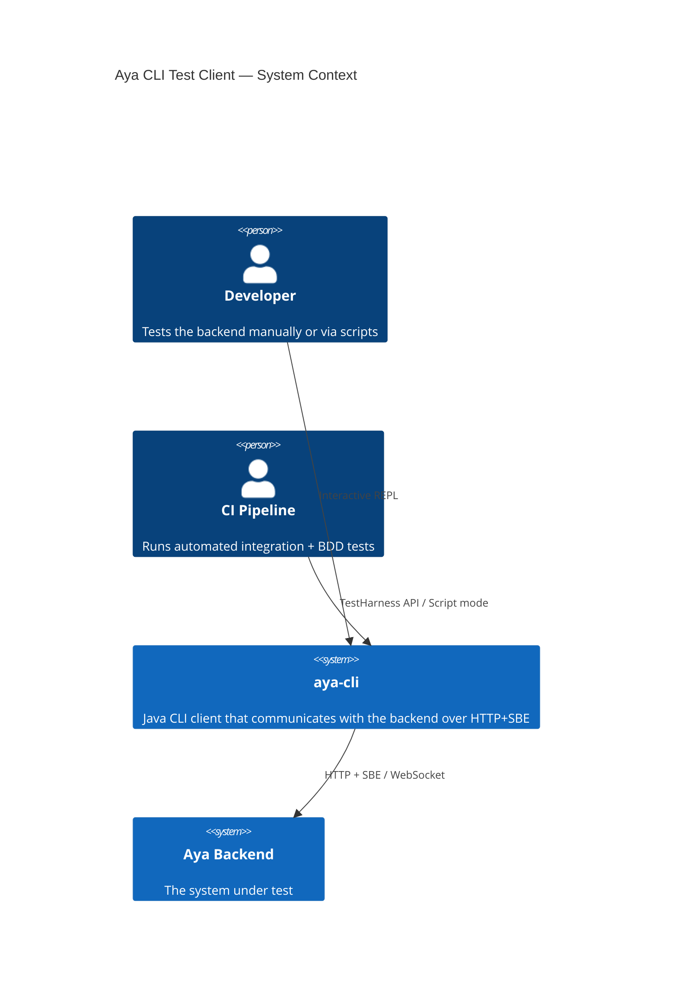
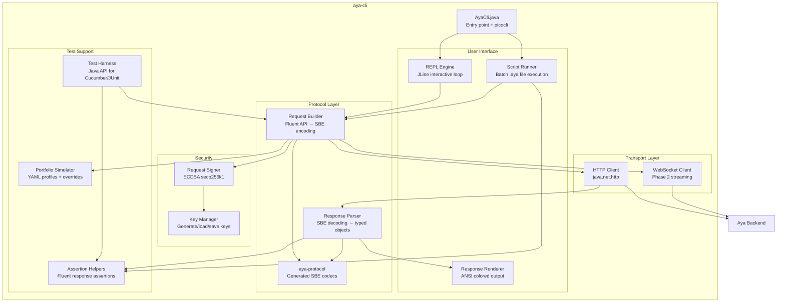
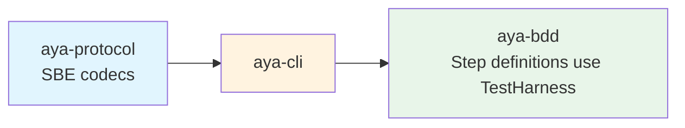
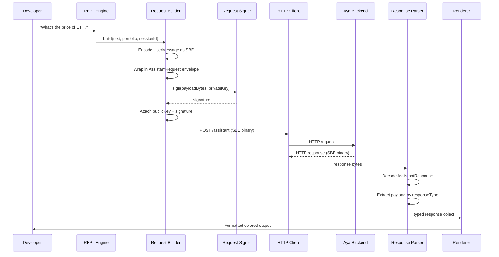
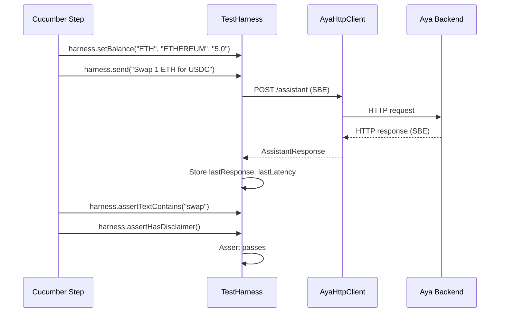
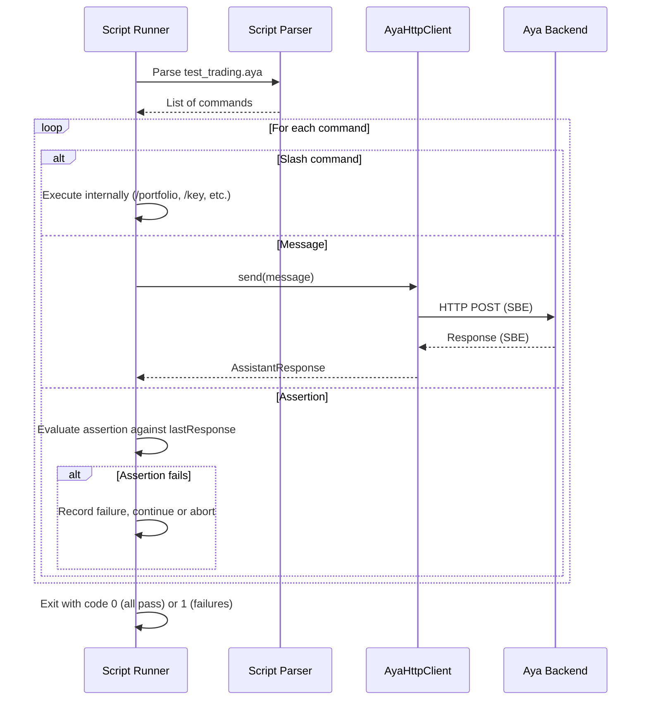

# Aya CLI Test Client — Architecture

**Version**: 1.0.0-draft
**Status**: Draft
**Last Updated**: 2026-03-24
**Parent**: [CLI_CLIENT_SPEC.md](CLI_CLIENT_SPEC.md)

---

## 1. System Context



## 2. Component Diagram



## 3. Module Dependencies



The CLI depends only on `aya-protocol` (for SBE codecs). The BDD module depends on the CLI (for `TestHarness`). The CLI has zero dependency on server-side code.

## 4. Data Flow — Interactive Message



## 5. Data Flow — Integration Test



## 6. Data Flow — Script Execution



## 7. Key Management Architecture

```
~/.aya-cli/
  keys/
    default.pem     # Default key pair (auto-generated on first run)
    alice.pem       # Named key for multi-user testing
    bob.pem
  config.yml        # Optional CLI configuration
  history           # REPL command history
```

Key pairs are ECDSA secp256k1 (same curve as Ethereum wallets). PEM format for portability. The CLI never accesses real wallet keys — it generates test-only keys.

## 8. Deployment

The CLI is a single fat JAR:

```bash
./gradlew :aya-cli:shadowJar
# Produces: aya-cli/build/libs/aya-cli.jar

java -jar aya-cli.jar                    # Interactive REPL
java -jar aya-cli.jar --script test.aya  # Batch mode
```

No installation beyond JDK 21+. No external dependencies at runtime.

---

*For the full CLI specification, see [CLI_CLIENT_SPEC.md](CLI_CLIENT_SPEC.md).*
*For behavioral expectations, see [CLI_CLIENT_BEHAVIORS_AND_EXPECTATIONS.md](CLI_CLIENT_BEHAVIORS_AND_EXPECTATIONS.md).*
