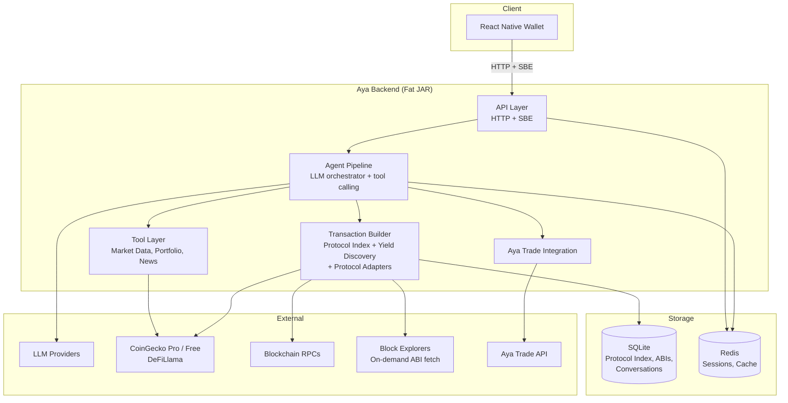

# Aya — Crypto Wallet AI Assistant Backend

## What is Aya

Aya is a backend agent service powering a conversational AI assistant embedded in a non-custodial crypto mobile wallet. It accepts SBE-encoded (Simple Binary Encoding) requests over HTTP from the React Native mobile app, routes them through a multi-model LLM-powered agent pipeline, and returns structured responses including conversational text, market data, and unsigned transactions for the user to sign on-device.

The system is designed to progressively shift execution from frontend functions (Phase 1) to server-generated transactions (Phase 2+), reducing dependence on app store releases and enabling complex multi-step blockchain operations from a lightweight mobile client. All trades are routed to **Aya Trade** — our own decentralized exchange — whenever possible.

## Architecture at a Glance



For detailed architecture diagrams (C4 context, container, component), data flows, and deployment topology, see [ARCHITECTURE.md](ARCHITECTURE.md).

## Tech Stack

| Component | Technology |
|-----------|-----------|
| Language | Java 21+ |
| HTTP Server | Netty (raw) |
| Build | Gradle (with SBE codegen plugin) |
| Protocol | SBE (Simple Binary Encoding) over HTTP |
| Streaming | WebSocket + SBE frames (Phase 2) |
| Local Storage | SQLite (embedded, zero-config) |
| External Service | Redis (managed, only external dependency) |
| LLM | Multi-provider: fast models for routing, powerful models for reasoning |
| Chains | EVM (Ethereum, Polygon, Arbitrum, Optimism, Base, BSC, Avalanche), Solana, Bitcoin |
| BDD | Cucumber + Gherkin |
| Unit Testing | JUnit 5 |
| Property Testing | jqwik |
| Benchmarking | JMH |
| Mobile Client | React Native (separate repo, shares SBE schema) |

## Project Structure

```
aya-backend/
  aya-protocol/          # SBE XML schemas, generated Java & TypeScript codecs
  aya-server/            # HTTP server, SBE codec, request routing, rate limiting
  aya-agent/             # Agent pipeline: intent classification, model routing, response assembly
  aya-tools/             # Tool implementations (market data, portfolio, settings, strategy)
  aya-txbuilder/         # Transaction builder: ABI/IDL registries, protocol adapters, tx pipeline
  aya-exchange/          # Aya Trade exchange integration
  aya-security/          # Authentication (public key signatures), input sanitization
  aya-index/             # Offline seed data tool: fetch ABIs/IDLs, bootstrap protocol index
  aya-cli/               # CLI test client: REPL, script mode, integration test harness
  aya-bdd/               # Cucumber BDD feature files and step definitions (uses aya-cli TestHarness)
```

## Getting Started

### Prerequisites

- **JDK 21+** (e.g., Eclipse Temurin, GraalVM)
- **Redis** instance (local `redis-server` or managed)

No Docker required. No external database.

### Build

```bash
./gradlew build
```

This compiles all modules, generates SBE codecs from the schema XML, and runs the fast test suite.

### Run

```bash
# Set required environment variables
export REDIS_URL=redis://localhost:6379
export ANTHROPIC_API_KEY=sk-ant-...
export OPENAI_API_KEY=sk-...
export COINGECKO_PRO_API_KEY=CG-...
export ETH_RPC_URL=https://...
export SOLANA_RPC_URL=https://...

# Start the server
java -jar aya-server/build/libs/aya-backend.jar
```

The server starts on port 8080 by default (configurable via `PORT` env var or `application.yml`).

### Tests

```bash
# Fast tests (unit + property-based, no I/O) — default for development
./gradlew test

# Full test suite (all categories)
./gradlew testFull

# Individual test suites
./gradlew testProperty        # Property-based tests (jqwik)
./gradlew testIntegration     # Real LLM + RPC + API integration tests
./gradlew testAdversarial     # Prompt injection and security tests
./gradlew testPerformance     # JMH benchmarks and latency tests
./gradlew protocolHealth      # Protocol liveness, ABI validity, exploit checks (CI cron weekly)

# BDD
./gradlew cucumber                                          # All feature files
./gradlew cucumber -Dcucumber.filter.tags="@phase1"         # Phase 1 only
./gradlew cucumber -Dcucumber.filter.tags="@phase1 and @fast"  # Fast Phase 1 BDD
```

## Protocol — SBE over HTTP

Aya uses **Simple Binary Encoding (SBE)** for all client-server communication, not JSON. SBE is a schema-driven binary encoding format with these benefits:

- **Type safety**: Every field, type, and constraint is defined in the schema XML
- **Code generation**: A single schema produces Java server codecs and TypeScript client codecs — both sides agree on the exact wire format
- **Compact**: Binary encoding reduces payload size on mobile networks
- **Versioned**: Additive-only schema evolution via `sinceVersion` — clients and servers at different versions communicate safely
- **Consistent**: Aya Trade already uses SBE, so the team has deep expertise

The schema is at `aya-protocol/src/main/resources/sbe/aya-assistant.xml`. See [SPEC.md Section 3](SPEC.md#3-sbe-protocol-definition) for the full message catalog.

## Phased Roadmap

| Phase | Scope | Key Features |
|-------|-------|-------------|
| **Phase 1 — Foundation** | Conversational assistant + client-side execution | SBE protocol, intent classification, market data tools, client-side execution (Uniswap swap, LiFi bridge), topic guardrails, disambiguation, security |
| **Phase 2 — Server Transactions** | Transaction builder + streaming + Aya Trade | Server-generated transactions (EVM, Solana, Bitcoin), ABI/IDL scouting, streaming responses via WebSocket, Aya Trade spot trading, portfolio RPC validation |
| **Phase 3 — Full Exchange** | Complete Aya Trade + advanced features | Aya Trade perps, commodities, limit/stop-loss orders, multi-session transaction tracking, Aya Trade as primary market data source |

## Related Documents

| Document | Description |
|----------|-------------|
| [SPEC.md](SPEC.md) | Exhaustive technical specification — system architecture, SBE protocol definition, agent pipeline, transaction builder, security model, and all other subsystems |
| [ARCHITECTURE.md](ARCHITECTURE.md) | System architecture with C4 diagrams, module decomposition, data flow diagrams, storage schemas, deployment model, and security architecture |
| [BEHAVIORS_AND_EXPECTATIONS.md](BEHAVIORS_AND_EXPECTATIONS.md) | Behavioral contract — desired/undesired behaviors, edge cases, performance expectations, and guardrail definitions |
| [features/](features/) | 24 BDD Gherkin feature files covering the backend (17 files + 1 health monitor) and CLI test client (6 files) |
| [CLI_CLIENT_SPEC.md](CLI_CLIENT_SPEC.md) | CLI test client specification — REPL, script mode, test harness, portfolio simulation |
| [CLI_CLIENT_ARCHITECTURE.md](CLI_CLIENT_ARCHITECTURE.md) | CLI test client architecture — component diagram, data flows |
| [CLI_CLIENT_BEHAVIORS_AND_EXPECTATIONS.md](CLI_CLIENT_BEHAVIORS_AND_EXPECTATIONS.md) | CLI test client behavioral contract |
| [AYA_INDEX_SPEC.md](AYA_INDEX_SPEC.md) | Protocol index tool specification — seed management, audit, health monitoring, bootstrap set, addition criteria |
| [AYA_INDEX_ARCHITECTURE.md](AYA_INDEX_ARCHITECTURE.md) | Protocol index tool architecture — component diagram, data flows |
| [AYA_INDEX_BEHAVIORS_AND_EXPECTATIONS.md](AYA_INDEX_BEHAVIORS_AND_EXPECTATIONS.md) | Protocol index tool behavioral contract |
| [CONTRIBUTING.md](CONTRIBUTING.md) | Developer rules — no Docker, performance over inheritance, GC-favorable patterns, SnakeYAML config, ADRs, no bugfix without tests |
| [docs/adr/](docs/adr/) | Architecture Decision Records — SBE over HTTP, SQLite+Redis, LLM-native design, fat JAR deployment, performance philosophy |
